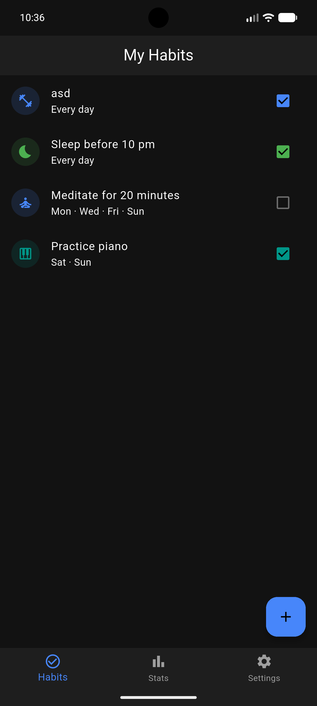
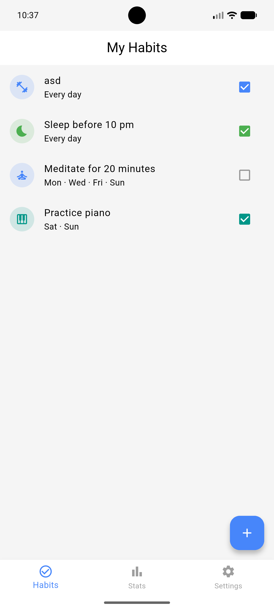
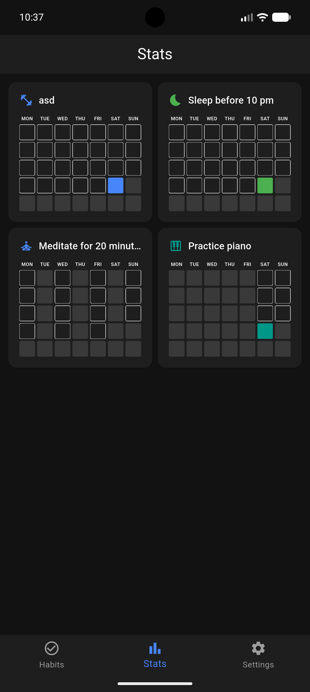
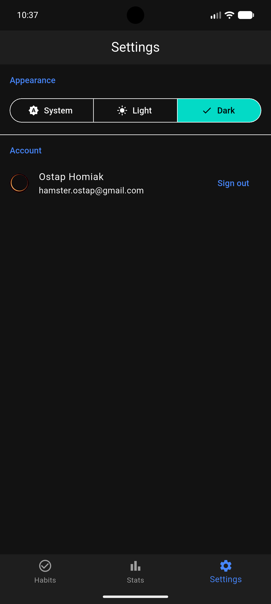

# Habit Tracker


A cross-platform mobile habit tracking app built with Flutter. Create habits with custom icons and colours, track daily completions, visualise consistency with a monthly heatmap calendar, and sync everything to the cloud with Google Sign-In.

<p align="center">
  
  &nbsp;
  
  &nbsp;
  
  &nbsp;
  
</p>

---

## Features

- **Habit management** — create habits with a name, colour, icon, and a custom weekday schedule; swipe left to delete
- **Daily tracking** — one-tap completion; checkbox is automatically disabled on days the habit is not scheduled
- **Monthly heatmap** — per-habit calendar grid covering the full current month, built from scratch without third-party chart packages
- **Cloud sync** — sign in with Google to sync habits and completions across devices via Firestore; fully offline-first with automatic sync on reconnect
- **Theming** — Light, Dark, and System theme modes, switchable instantly from Settings

---

## Tech Stack

| Concern | Library |
|---|---|
| UI framework | Flutter + Material 3 |
| State management | Riverpod 3 with `riverpod_annotation` code generation |
| Navigation | `go_router` with `ShellRoute` wrapping three tabs |
| Local storage | Hive with code-generated type adapters |
| Cloud database | Cloud Firestore with offline persistence enabled |
| Authentication | Firebase Auth + `google_sign_in` |
| Immutable models | Freezed 3 |

---


## Getting Started

### Prerequisites

- Flutter SDK ≥ 3.x / Dart ≥ 3.x
- Android Studio (for Android targets) or Xcode (for iOS/macOS)
- A Firebase project with **Firestore** and **Google Sign-In** enabled

### Install & run

```bash
flutter pub get

# Regenerate Freezed / Riverpod / Hive adapters (only needed after model changes)
dart run build_runner build

# Run 
flutter run 
```

### Firebase setup

Create a Firebase project and enable **Firestore Database** and **Google Sign-In** (Authentication → Sign-in method).

Run `flutterfire configure`

---

## Platform support

| Platform | Runs | Google Sign-In | 
|---|---|---|
| Android | yes | yes |
| iOS | yes | ? | - not tested yet
| macOS | yes | ? | - not tested yet
| Web | yes | no |
| Windows | yes | no |
